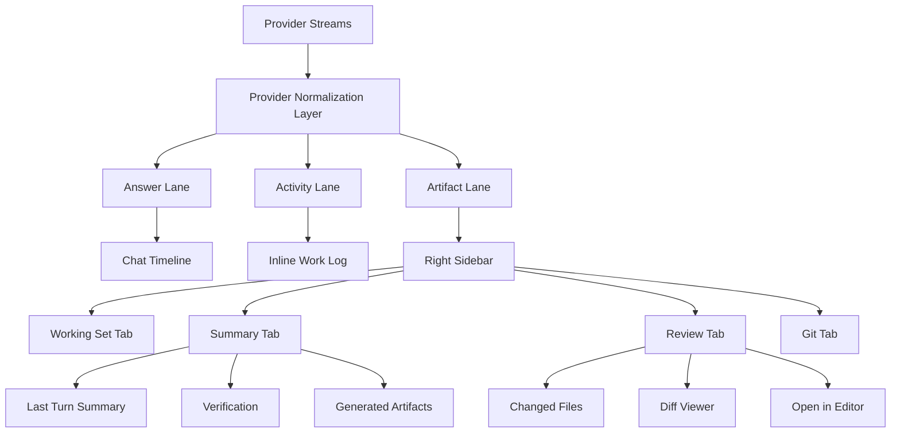

# Codex Desktop Feature Parity Rollout

## Purpose

This document defines the rollout plan for bringing Nidavellir's chat, activity, artifact, and right-sidebar experience closer to Codex Desktop.

The central design shift is this:

Nidavellir should stop treating provider output as one raw chat stream. Provider output must be normalized into three UI lanes before rendering:

1. **Answer lane**: clean assistant prose meant for the user.
2. **Activity lane**: work log, tool calls, searches, reads, tests, problems, compaction events.
3. **Artifact lane**: diffs, changed files, generated docs, code refs, verification results.

The current `ContextPanel` / Working Set sidebar should be reimagined as a robust Codex-style right sidebar with tabs for `Working Set`, `Summary`, `Review`, and later `Git`.

## Current Baseline

Nidavellir already has several foundations in place:

- Chat timeline and user bubbles in `frontend/src/components/chat/MessageList.tsx`.
- Stream parsing in `frontend/src/lib/parsers/*`.
- Activity grouping in `frontend/src/lib/activityTimeline.ts`.
- Completion report generation in `frontend/src/lib/completionReport.ts`.
- Markdown rendering and live refs in `MarkdownRenderer` / `liveRefs`.
- Working Set, token usage, and memory health in `frontend/src/components/chat/ContextPanel.tsx`.
- Workspace/CWD selection and display.
- Send/stop behavior, Escape cancel, and websocket turn resume work.

The gap is not that Nidavellir lacks primitives. The gap is that those primitives are not yet composed into a coherent Codex-style review surface.

## Recommended Rollout Strategy

Roll this out in vertical slices, not broad internal layers. Each phase should produce a visible UX improvement while preserving normal chat behavior.

The highest-risk area is not the sidebar UI. The highest-risk area is the stream boundary: provider output, websocket replay, duplicate snapshots, warnings, tool events, diffs, and final answer text all arrive close together. Stabilize that boundary before relying on it for richer sidebar features.

Recommended sequence:

1. **First sprint: provider normalization + sidebar shell extraction.**
   - Harden the Answer / Activity / Artifact split.
   - Keep raw provider noise out of the visible answer.
   - Extract the existing Working Set UI into a tabbed `RightSidebar`.
   - Preserve current Working Set behavior exactly.
   - Add empty or placeholder `Summary` and `Review` tabs so the app direction is visible without requiring the full review engine immediately.

2. **Ship Summary before Review.**
   - Summary can reuse existing completion report and activity data.
   - It proves that turn-derived sidebar state works before diff rendering gets involved.

3. **Ship simple Review before advanced Review.**
   - Start with changed file rows, +/- counts, and basic colored diffs.
   - Delay syntax highlighting, fold rows, retry states, and large-file polish until the simple review workflow is stable.

4. **Wire chat refs to sidebar after Review exists.**
   - Do not build navigation affordances before there is a reliable target state.
   - File/code refs should open the Review tab, select the file, then scroll/highlight the line or range.

5. **Keep Git controls last and initially read-only.**
   - Branch and dirty-state display can come first.
   - Commit, push, and PR controls should wait until review state is trustworthy and user intent is explicit.

This rollout avoids a large UI rewrite. The current `ContextPanel` becomes the seed of the new right sidebar instead of being discarded.

## Target UX



## Product Requirements

### Chat Timeline

- User messages remain compact bubbles.
- Agent messages render as clean document-style text, not cards.
- Provider warnings and lifecycle messages must not pollute final answer text.
- Agent activity is visible via an inline expandable work log.
- Completion summaries remain visible after a build task finishes.
- Code/file references are clickable and line-aware.

### Activity Timeline

- Show readable progress statements.
- Group reads/searches/tests/writes into compact summaries.
- Show tool problems as problem callouts.
- Show context compaction as an explicit timeline marker.
- Hide lifecycle noise such as provider startup and heartbeat unless expanded into debug detail.
- Deduplicate repeated provider snapshots and replayed websocket frames.

### Right Sidebar

The current right sidebar should evolve from `Working Set` into a mode-based panel:

- `Working Set`: files, token usage, memory health.
- `Summary`: last turn summary, duration, verifications, generated docs.
- `Review`: changed files, diffs, file stats, open-in-editor.
- `Git`: branch, staged state, commit/push controls. This should come last.

The right sidebar should be independently scrollable, collapsible, and eventually resizable.

### Review Sidebar

- Changed file list with path, additions, deletions, and status.
- Expand/collapse each file.
- Render inline diff hunks.
- Preserve context rows and folded unchanged-line markers.
- Open local file in VS Code at exact line.
- Clicking a chat code/file ref should open the sidebar Review tab and select the file.

## Architecture

### Event Model

Define a stable internal event model. Provider-specific parsers should emit these normalized events.

```ts
type NidStreamEvent =
  | { type: "answer_delta"; content: string }
  | { type: "activity.progress"; content: string }
  | { type: "activity.tool_start"; id: string; name: string; args: string }
  | { type: "activity.tool_end"; id: string; status: string; summary?: string }
  | { type: "artifact.diff"; filePath?: string; content: string }
  | { type: "artifact.file_ref"; path: string; startLine?: number; endLine?: number }
  | { type: "artifact.generated_doc"; path: string; title?: string }
  | { type: "system.compaction"; summary?: string }
  | { type: "turn.summary"; content: string };
```

The current `StreamEvent` type can evolve toward this model without a big-bang rewrite. Existing events can be mapped into this shape behind compatibility helpers.

### Store Shape

Add a review/artifact slice to the agent store or a sibling Zustand store.

```ts
interface TurnArtifactState {
  activeTurnId: string | null;
  selectedSidebarTab: "working-set" | "summary" | "review" | "git";
  reviewFiles: ReviewFile[];
  generatedArtifacts: GeneratedArtifact[];
  lastTurnSummary: TurnSummary | null;
}

interface ReviewFile {
  path: string;
  status: "modified" | "added" | "deleted" | "renamed" | "unknown";
  additions: number;
  deletions: number;
  hunks: DiffHunk[];
  selected?: boolean;
  expanded?: boolean;
}

interface DiffHunk {
  oldStart?: number;
  oldLines?: number;
  newStart?: number;
  newLines?: number;
  lines: DiffLine[];
}

interface DiffLine {
  kind: "context" | "add" | "delete" | "meta" | "fold";
  oldLine?: number;
  newLine?: number;
  content: string;
}
```

### Component Plan

Proposed components:

- `RightSidebar.tsx`: tab shell, collapse, resize later.
- `WorkingSetTab.tsx`: extracted from current `ContextPanel`.
- `SummaryTab.tsx`: last turn summary, verification, generated artifacts.
- `ReviewTab.tsx`: changed file list + selected file diff.
- `DiffViewer.tsx`: reusable diff renderer.
- `ChangedFileRow.tsx`: file row with counts and expand/open controls.
- `SidebarTabs.tsx`: tab switching.
- `useTurnArtifacts.ts`: selector/helpers for artifact state.

## Rollout Plan

### Phase 1: Normalize Provider Streams

Goal: make rendered chat stable and clean.

Tasks:

- Harden Claude, Codex, and Ollama parsers around duplicate snapshots.
- Route provider/library warnings to activity, not answer text.
- Add tests for repeated/cumulative snapshots and websocket replay.
- Add tests for splitter warnings like `Separator is found, but chunk is longer than limit`.
- Add a compatibility mapper from current `StreamEvent` to future lane model.

Acceptance criteria:

- Repeated provider output does not duplicate in the visible answer.
- Lifecycle/progress warnings appear only in activity.
- Answer lane contains only user-facing prose.

### Phase 2: Extract Sidebar Shell

Goal: replace single-purpose `ContextPanel` with a tabbed right sidebar while preserving existing Working Set behavior.

Tasks:

- Rename/reframe `ContextPanel` into `RightSidebar`.
- Extract current file/token/memory UI into `WorkingSetTab`.
- Add tab state: `Working Set`, `Summary`, `Review`.
- Preserve close/collapse behavior.
- Add tests that current Working Set functionality still works.

Acceptance criteria:

- Existing Working Set behavior is unchanged.
- Sidebar can switch tabs without affecting chat state.
- Sidebar remains independently scrollable.

### Phase 3: Build Summary Tab

Goal: make the last turn understandable after completion.

Tasks:

- Move/duplicate compact completion report data into sidebar state.
- Show duration, outcome, verification commands, generated docs, and changed-file summary.
- Keep inline chat report compact.
- Add “Open Review” affordance when changed files exist.

Acceptance criteria:

- Build tasks produce a visible Summary tab entry.
- Normal chat answers do not produce noisy build reports.
- Verification commands are shown with status.

### Phase 4: Build Review Tab

Goal: provide Codex-style changed-file review.

Tasks:

- Parse diff events into structured `ReviewFile` records.
- Render changed file list with `+/-` counts.
- Add selected-file diff viewer.
- Add expand/collapse file rows.
- Add “Open in editor” using existing `refs:open-code` bridge.
- Add tests for diff parsing and review rendering.

Acceptance criteria:

- Changed files appear in the right sidebar.
- Selecting a file shows its diff.
- Additions/deletions are colored and counted.
- Open-in-editor works for local paths.

### Phase 5: Chat ↔ Sidebar Linking

Goal: make chat refs and sidebar review work together.

Tasks:

- Clicking a file/code ref opens the Review tab.
- If the file exists in review state, select it.
- If a line/range is known, scroll/highlight it.
- Generated docs open in Summary or local editor.

Acceptance criteria:

- Chat file refs are actionable.
- Code refs navigate to exact file/line where possible.
- Sidebar state follows user intent without jarring navigation.

### Phase 6: Diff Viewer Upgrade

Goal: improve review readability.

Tasks:

- Add hunk headers.
- Add folded unchanged-line rows.
- Add line numbers.
- Add syntax highlighting where feasible.
- Add retry/fallback state for large or failed file loads.

Acceptance criteria:

- Diffs are readable for large files.
- File rows can be expanded/collapsed.
- Unchanged context can be folded.

### Phase 7: Git Tab

Goal: add Codex-like commit workflow after review state is reliable.

Tasks:

- Show current branch.
- Show dirty file state.
- Add stage/unstage controls if needed.
- Add commit dropdown.
- Add push/PR affordances later.

Acceptance criteria:

- Git tab is read-only first.
- Mutating Git actions require explicit user intent.
- Commit controls do not appear until review/diff state is stable.

## Testing Strategy

### Unit Tests

- Provider parsers normalize repeated snapshots.
- Activity timeline groups tools correctly.
- Diff parser creates correct file/hunk structures.
- Completion report does not derive outcome from raw visible answer.
- Sidebar tab state is stable.

### Component Tests

- Working Set tab preserves existing file/token/memory behavior.
- Summary tab renders last turn report.
- Review tab renders changed files and diffs.
- Chat ref click opens sidebar and selects file.

### E2E Tests

- Run a mocked build turn with activity, diff, verification, and summary.
- Assert chat answer is clean.
- Assert activity can expand.
- Assert Review tab shows changed files.
- Assert clicking a code ref opens/highlights the matching file.

## Migration Notes

The current `ContextPanel` should not be discarded. It should be split:

- `ContextPanel` responsibilities become `WorkingSetTab`.
- Panel chrome becomes `RightSidebar`.
- Token and memory widgets remain useful.
- The close button remains.
- Later, add resize and popout behavior.

Avoid rewriting the whole chat screen in one pass. The safest path is extraction first, then tab additions.

## Risks

- Provider streams are inconsistent; normalization must be defensive.
- Diff extraction from raw CLI output may be incomplete for some providers.
- Replayed websocket frames can duplicate artifacts unless keyed by `turn_id` and event identity.
- Large diffs can hurt UI performance if rendered all at once.
- Git controls can become dangerous if added before review state is trustworthy.

## Non-Goals For Initial Rollout

- Full GitHub PR workflow.
- Multi-window Electron support.
- Persistent activity logs for every turn.
- Full IDE replacement.
- Rich merge conflict resolution.

## Definition Of Done

Feature parity is good enough when:

- Agent answers look like clean Codex-style prose.
- Activity expands into a readable work log.
- Build tasks produce a useful summary.
- Changed files appear in a right-sidebar Review tab.
- Diffs are inspectable without leaving the app.
- Code/file refs are clickable and line-aware.
- Existing Working Set, token, and memory behavior still works.
