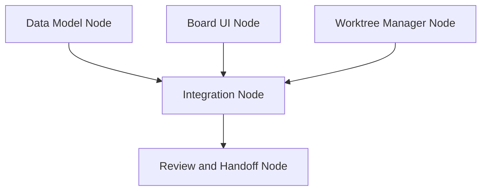

# Nidavellir Orchestration Project Spec

Status: Draft v1  
Purpose: Define the next major Nidavellir capability: a local-first orchestration layer combining a project board, interactive DAG, linear node flows, git worktrees, agent runs, command verification, and review handoff.

## 1. Product Intent

Nidavellir should evolve from a single-conversation agent workbench into an orchestration workbench.

The goal is to let a user break project work into coordinated units, understand dependencies, run agents in isolated workspaces, verify outputs, and review results without losing visibility into what happened.

The orchestration layer should make these questions answerable inside Nidavellir:

- What work exists?
- What is blocked?
- What can run now?
- Which tasks can run in parallel?
- Which agent/provider/model is responsible for each stream of work?
- Which git worktree contains the work?
- What commands verified it?
- What changed?
- What evidence exists for review?

## 1.1 Intake Modes

Nidavellir should support two first-class intake modes rather than forcing every job through the same ceremony.

### New Project Mode

New Project Mode is spec-first. Use it when the repo, architecture, project structure, or product direction is not already established.

Required path:

1. User and PM refine rough intent into an approved agentic-forward spec.
2. Repo target or new-project setup path is locked.
3. Decomposer turns the approved spec into candidate tasks.
4. EM accepts only atomic worktree-sized tasks.
5. Agents execute in isolated worktrees with checkpoint proof.

### Existing Project Mode

Existing Project Mode is lane-first. Use it when an established repo already supplies architecture, conventions, tests, scripts, and product gravity.

Required path:

1. User selects an existing repo.
2. Nidavellir inspects repo shape, scripts, tests, branch state, and recent status.
3. User chooses a lane such as feature, bugfix, chore, docs, review, triage, or research.
4. PM produces a bounded task brief rather than a full project spec.
5. EM still validates atomicity before worktree execution.

Both modes feed the same Task Inbox, EM, worktree, execution, checkpoint, and review systems. Risky or externally visible actions still require Greenlight approval.

## 2. Design Sources

This spec combines two architectural influences:

### Symphony-Inspired Lessons

From OpenAI Symphony, Nidavellir should adopt:

- A clear workflow contract.
- Separation between policy, coordination, execution, integration, and observability.
- Isolated workspaces per unit of work.
- Bounded concurrency.
- Retry/cancel/reconcile concepts.
- Structured runtime state.
- Operator-visible logs and status.

Nidavellir should not copy Symphony as a polling daemon or issue-tracker-first system. Nidavellir is an interactive desktop product, so the first orchestration experience should be user-driven and visible.

### Quilby-Inspired Lessons

From the Quilby architecture, Nidavellir should adopt:

- Provider-agnostic agent event normalization.
- Session/process registry concepts.
- Explicit planning/review state machines.
- Multi-agent perspectives as reusable workflow roles.
- Agent identity/profile boundaries.
- Append-only event streams for session recovery and auditability.

Nidavellir should not adopt a Rust/Tauri rewrite, a scheduler-first architecture, or hardcoded planning agents as the only workflow model.

## 3. Core Product Model

Nidavellir orchestration has four zoom levels:

1. **Project Board**: human workflow status.
2. **DAG**: dependency and parallelism structure.
3. **Node**: a stream of work inside the DAG.
4. **Step**: a linear action inside a node.

The board answers: "Where is the work?"

The DAG answers: "What depends on what?"

The node answers: "What stream of work is this?"

The step answers: "What exactly happens next?"

## 4. Board and DAG Relationship

The board and DAG are linked views over the same orchestration state.

The DAG owns execution truth.

The board is a projection for human planning and status.

Board columns may include:

- Backlog
- Ready
- Running
- Review
- Done
- Blocked

Moving a board card may update task status, but it must not silently override incompatible DAG state. If a card is moved to Review while required nodes are incomplete, Nidavellir should surface that mismatch.

## 5. DAG Model

Each task owns a DAG.

Each DAG has nodes and directed dependency edges.

Nodes may run in parallel when:

- all upstream nodes are complete or skipped,
- the node has at least one runnable step,
- permissions allow it,
- concurrency limits allow it.

The DAG should stay strategic. It should not become a giant graph of every command, message, and micro-action. Tactical detail belongs inside node steps.

Example:



## 6. Node Flow Model

Each node owns a linear flow of steps.

Steps execute in order. A node can be considered complete only when its required steps are complete, skipped, or otherwise resolved according to policy.

Example node flow:

```text
Node: Worktree Manager
1. Validate repository
2. Create branch
3. Create git worktree
4. Register worktree with task
5. Run git status verification
6. Mark node ready for downstream work
```

Initial step types:

- `manual`: user completes or confirms the step.
- `agent`: agent performs work.
- `command`: command runner executes a command.
- `review`: user or agent reviews output.
- `gate`: permission or approval checkpoint.
- `artifact`: produce or attach output.
- `handoff`: make output available to downstream nodes.

Step types should remain extensible.

## 7. Status Model

### Task Status

Task status should support:

- `backlog`
- `ready`
- `running`
- `review`
- `done`
- `blocked`
- `cancelled`

### Node Status

Node status should support:

- `not_started`
- `ready`
- `running`
- `blocked`
- `failed`
- `complete`
- `skipped`
- `cancelled`

### Step Status

Step status should support:

- `pending`
- `ready`
- `running`
- `waiting_for_user`
- `failed`
- `complete`
- `skipped`
- `cancelled`

Node status should generally derive from step status and dependency state.

## 8. Git Worktree Strategy

Git worktrees are the isolation boundary for agent implementation work.

Each task may have one primary worktree. Advanced DAGs may later support per-node worktrees, but the first implementation should use one worktree per task unless there is a strong reason to split.

Worktree fields:

- base repository path
- base branch
- task branch
- worktree path
- creation status
- cleanup status

Recommended branch naming:

```text
nid/<task-slug-or-id>
```

Recommended worktree location:

```text
<repo>/.nidavellir/worktrees/<task-id>
```

Worktree operations must go through path protection and permission policy.

Initial supported operations:

- create worktree
- list task worktrees
- inspect worktree git status
- mark worktree for cleanup
- remove worktree after explicit user approval

Destructive cleanup must not happen automatically.

## 9. Agent Execution Strategy

Initial orchestration should be manual-first.

The first implementation should not automatically run every ready node. Instead, the user should explicitly run a node or step.

Execution path:

1. User opens task.
2. User selects a node.
3. User runs the next ready step.
4. Nidavellir creates a run attempt.
5. The step runs in the task worktree.
6. Output is captured as artifacts and events.
7. Status updates are reflected in the node, DAG, and board.

Later automation may support:

- auto-run ready nodes,
- bounded parallel dispatch,
- retries with backoff,
- background queues,
- scheduled orchestration.

## 10. Provider and Agent Event Model

Provider-specific output should be normalized before reaching orchestration.

Initial event categories:

- `session_started`
- `text_delta`
- `tool_started`
- `tool_finished`
- `command_output`
- `file_changed`
- `usage_update`
- `turn_complete`
- `error`
- `raw_provider_event`

All orchestration events must include enough routing metadata:

- task id
- node id
- step id
- run attempt id
- conversation id, if applicable
- provider/model, if applicable
- worktree path, if applicable

Provider-specific raw events may be preserved for debugging, but orchestration logic should consume normalized events.

## 11. Orchestration Event Stream

Every meaningful orchestration action should emit an append-only event.

Examples:

- task created
- node added
- edge added
- step added
- worktree created
- node became ready
- step started
- agent run started
- command output captured
- artifact created
- step failed
- node completed
- task moved to review

This supports:

- UI recovery,
- audit bundles,
- debugging,
- future replay,
- future automation.

## 12. Artifacts

Artifacts are durable evidence created during orchestration.

Artifact types:

- command output
- agent summary
- changed file list
- diff
- audit bundle
- review finding
- generated document
- handoff note

Artifacts should be attachable to downstream node context when the user chooses.

## 13. Data Model Draft

Initial tables or equivalent persistence models:

### `orchestration_tasks`

- `id`
- `title`
- `description`
- `status`
- `priority`
- `labels_json`
- `conversation_id`
- `base_repo_path`
- `base_branch`
- `task_branch`
- `worktree_path`
- `created_at`
- `updated_at`

### `orchestration_nodes`

- `id`
- `task_id`
- `title`
- `description`
- `status`
- `provider`
- `model`
- `skill_ids_json`
- `position_x`
- `position_y`
- `created_at`
- `updated_at`

### `orchestration_edges`

- `id`
- `task_id`
- `from_node_id`
- `to_node_id`
- `created_at`

### `orchestration_steps`

- `id`
- `node_id`
- `order_index`
- `type`
- `title`
- `description`
- `status`
- `config_json`
- `output_summary`
- `created_at`
- `updated_at`

### `orchestration_run_attempts`

- `id`
- `task_id`
- `node_id`
- `step_id`
- `conversation_id`
- `provider`
- `model`
- `worktree_path`
- `status`
- `started_at`
- `completed_at`
- `error`

### `orchestration_artifacts`

- `id`
- `task_id`
- `node_id`
- `step_id`
- `run_attempt_id`
- `type`
- `title`
- `summary`
- `content`
- `metadata_json`
- `created_at`

### `orchestration_events`

- `id`
- `task_id`
- `node_id`
- `step_id`
- `run_attempt_id`
- `type`
- `payload_json`
- `created_at`

## 14. UI Requirements

### Project Board

The board must show:

- task title,
- status,
- priority,
- labels,
- node completion count,
- worktree/branch indicator,
- blocked/running/review state.

Users must be able to:

- create a task,
- edit a task,
- move a task between columns,
- open task detail,
- archive or cancel a task.

### Task Detail

Task detail must show:

- task metadata,
- linked conversation,
- worktree and branch,
- DAG view,
- selected node detail,
- artifacts,
- event history.

### Interactive DAG

The DAG must support:

- render nodes and edges,
- select node,
- add node,
- edit node,
- delete node,
- add dependency edge,
- remove dependency edge,
- show runnable/blocked/running/complete states.

The first implementation may use a simple layout. Drag positioning can come later if needed.

### Node Detail

Node detail must show:

- node status,
- provider/model,
- skills,
- dependency status,
- linear step list,
- next runnable step,
- run history,
- artifacts.

Users must be able to:

- add/edit/delete steps,
- mark manual steps complete,
- run eligible command steps,
- eventually run eligible agent steps.

## 15. Permission and Safety Requirements

Permission gates must apply to:

- git worktree creation,
- worktree removal,
- branch creation,
- shell commands,
- file writes,
- destructive cleanup,
- merge/push/PR operations when added.

Path protection must ensure node execution stays within the intended worktree unless explicitly approved.

Initial orchestration should prefer user-initiated execution over background automation.

## 16. Audit Bundle Integration

Audit bundles should become orchestration-aware.

Future audit bundles should optionally include:

- task metadata,
- DAG nodes and edges,
- node steps,
- run attempts,
- artifacts,
- worktree metadata,
- permission decisions,
- command output if explicitly included,
- agent summaries,
- review handoff state.

Sensitive artifacts should be redacted by default.

## 17. Initial Implementation Sequence

### Phase 1: Persistence and API

Build the orchestration data model and backend CRUD APIs.

Deliverables:

- task CRUD,
- node CRUD,
- edge CRUD,
- step CRUD,
- event append/list,
- basic readiness calculation.

No agent execution yet.

### Phase 2: Board MVP

Build the project board UI.

Deliverables:

- board columns,
- task cards,
- create/edit task,
- move task between columns,
- open task detail.

### Phase 3: DAG and Node Flow MVP

Build the DAG and node detail UI.

Deliverables:

- DAG renderer,
- node selection,
- edge editing,
- step list,
- manual step completion,
- runnable/blocked state display.

### Phase 4: Worktree Manager

Add git worktree support.

Deliverables:

- create task worktree,
- branch naming,
- worktree status,
- permission-gated cleanup,
- command runner can target task worktree.

### Phase 5: Command Step Execution

Connect command runner to node steps.

Deliverables:

- command step config,
- run command step,
- capture output as artifact,
- update step/node status,
- attach command output to downstream context.

### Phase 6: Agent Step Execution

Run agents against task worktrees from node steps.

Deliverables:

- provider/model selection per node,
- skill selection per node,
- run attempt creation,
- conversation/session linkage,
- artifact capture,
- cancellation.

### Phase 7: Parallel Orchestration

Add controlled parallelism.

Deliverables:

- runnable node detector,
- bounded concurrency,
- manual "run all ready" action,
- cancellation,
- retry.

### Phase 8: Review and Merge Handoff

Close the loop from execution to review.

Deliverables:

- changed-file summary,
- verification summary,
- audit bundle link,
- review state,
- explicit merge/PR preparation.

## 18. Non-Goals for Initial Build

The first orchestration build should not include:

- external issue tracker integration,
- automatic background daemon polling,
- multi-tenant control plane,
- automatic merging,
- automatic destructive worktree cleanup,
- full scheduler/cron system,
- Rust/Tauri rewrite,
- hardcoded planning agents as the only workflow path.

## 19. Open Product Questions

These should be resolved during Phase 1 or early Phase 2:

- Should a task always have exactly one DAG, or can it have multiple DAG versions?
- Should node templates be stored as skills, separate templates, or both?
- Should worktree be per task by default, with per-node worktrees only as an advanced option?
- What is the minimum useful graph layout before drag/drop positioning?
- How much board movement should be allowed when DAG state disagrees?
- Should a completed node automatically publish artifacts to downstream nodes, or require explicit handoff?
- Which orchestration artifacts should appear in the existing Audit tab?

## 20. Success Criteria

The first meaningful orchestration release is successful if a user can:

1. Create a task on a project board.
2. Open the task and define a DAG.
3. Add nodes with ordered steps.
4. Mark manual steps complete.
5. See which nodes are blocked or ready.
6. Create an isolated git worktree for the task.
7. Run at least one command step in that worktree.
8. Capture command output as an artifact.
9. Review task state and artifacts from the UI.

Agent execution can land after this without changing the underlying model.
